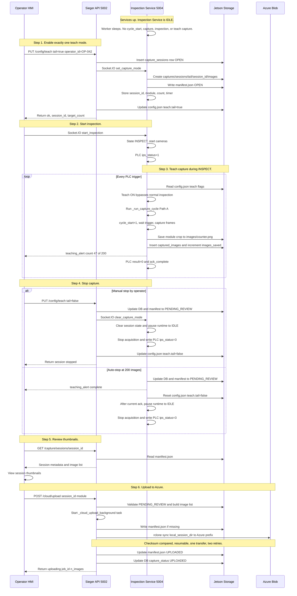

# Teach Capture & manifest.json — Corrected Workflow

**Scope:** Teach-mode data capture → manifest.json → Review → Azure Blob Upload via rclone sync  
**Date:** 2026-05-28 · **Status:** Implemented — reflects actual production code  

---

## Operator Workflow — End-to-End



**Recommended operator order:** turn exactly one teach toggle ON, then press Start Inspection. If inspection is already running, turning teach ON is still picked up on the next cone cycle because the inspection service rereads `config.json` at the top of every `_run_inspection_cycle()`.

---

## Implemented Components — Current State

All components below are implemented and in production. This table reflects the actual code state.

### Implemented — session lifecycle

| Component | Location | What it does |
|-----------|----------|--------------|
| `capture_sessions` table (v7) | `src/db/schema.py` | Audit trail — `session_id`, `module`, `material_ids`, `started_at`, `stopped_at`, `images_saved`, `stopped_by`, `operator_id`, `capture_status` |
| `captured_images` table | `src/db/schema.py` | One row per saved frame — `session_id`, `material_id`, `module`, `vl_path`, `uv_path`, `tail_path` |
| `teaching_sessions` table | `src/db/schema.py` | Teaching event record per module |
| `PUT /config/teach` | `src/api/main.py` | **Sole entry point.** Toggle ON creates one DB session + emits `set_capture_mode`; Toggle OFF stops session + updates manifest + emits `clear_capture_mode`. |
| `POST /capture/sessions/start` | `src/api/main.py` | **DEPRECATED.** Kept for compatibility but emits warning. |
| `POST /capture/sessions/stop` | `src/api/main.py` | **DEPRECATED.** Kept for compatibility but emits warning. |
| `GET /capture/sessions/{session_id}` | `src/api/main.py` | Returns manifest.json from disk, falls back to DB |
| `GET /capture/sessions` | `src/api/main.py` | Lists sessions |
| `GET /capture/images` | `src/api/main.py` | Filtered image list from `captured_images` |
| `PUT /config/tasks` | `src/api/main.py` | Writes `config.inspection.tasks.*` to `config.json` |
| `POST /cloud/upload` | `src/api/main.py` | Validates session, builds image list, spawns `_cloud_upload_background()` |
| `set_capture_mode` socket event | `inspection_service.py` | Sets active teach session state and writes manifest.json. It does **not** start the worker from IDLE. |
| `clear_capture_mode` socket event | `inspection_service.py` | Clears session counters and pauses runtime to IDLE: flushes buffers, stops acquisition, writes PLC `ips_status=3`. |
| `_run_inspection_cycle()` teach override | `inspection_service.py` | Reads `config.json` every cycle; any teach flag routes into `_run_capture_cycle()` Path A and bypasses normal inspection. |
| `_run_capture_cycle()` Path A | `inspection_service.py` | Captures all materials when `capture_material_ids` is empty; saves module crop, writes `captured_images`, increments `images_saved`, emits progress, writes PLC result=0, sends ack. |
| `_write_manifest()` | `inspection_service.py` | Creates `captures/sessions/<module>/<session_id>/` + `images/` + `manifest.json`. `inspection_type` derived from `module.upper()`. |
| `_finalize_teach_session()` | `inspection_service.py` | Updates manifest to PENDING_REVIEW, updates DB, clears state, emits alert, resets config teach flag to false, and requests runtime pause after the current cone is acknowledged. |
| `_pause_inspection_runtime()` | `inspection_service.py` | Shared stop/pause helper: `IDLE`, camera buffer flush, acquisition stop, PLC `ips_status=3`. |
| `_get_device_identity()` | `inspection_service.py` | Reads `/proc/device-tree/serial-number` → SHA256 → `JX-XXXXXX` |
| `_save_crop()` conditional routing | `inspection_service.py` | Routes to `captures/sessions/…/images/` when session active, legacy path otherwise |
| `teaching_alert` per frame | `inspection_service.py` | Emitted after every image save — `{module, stage, message, count, total}` |
| `src/.env` | `src/.env` | Azure `connection_string` and `container` — loaded at API startup |
| `BlobUploader` (rclone engine) | `src/cloud/uploader.py` | Uses `rclone sync` subprocess; validates `rclone` on PATH |

---

## Schema Changes — Migration v7

Add two columns to `capture_sessions`. No new tables needed.

```python
_MIGRATION_V6_TO_V7 = """
ALTER TABLE capture_sessions ADD COLUMN operator_id     TEXT;
ALTER TABLE capture_sessions ADD COLUMN capture_status  TEXT NOT NULL DEFAULT 'OPEN';
"""

# Bump in schema.py:
SCHEMA_VERSION = 7
```

Migration chain in `init_db()` adds:
```python
if current == 6:
    conn.executescript(_MIGRATION_V6_TO_V7)
    current = 7
```

### Updated `capture_sessions` table (full picture after migration)

```
capture_sessions
├── session_id      TEXT  PRIMARY KEY          -- uuid4 hex e.g. "a1b2c3d4e5f6789012345678abcdef90"
├── module          TEXT  NOT NULL             -- tail | stain | uv | dimension
├── material_ids    TEXT  NOT NULL             -- JSON array e.g. ["GLOBAL-TAIL"] or ["42","55"]
├── started_at      TEXT  NOT NULL             -- ISO-8601 UTC
├── stopped_at      TEXT                       -- NULL while OPEN
├── images_saved    INTEGER DEFAULT 0          -- running count (incremented per frame)
├── stopped_by      TEXT                       -- 'operator' | 'auto' | 'plc_stop'
├── operator_id     TEXT                       -- NEW: from UI e.g. "OP-042"
└── capture_status  TEXT  DEFAULT 'OPEN'       -- NEW: OPEN → PENDING_REVIEW → UPLOADED
```

---

## Session ID Format

```
uuid4 hex — 32 hex chars
e.g. a1b2c3d4e5f6789012345678abcdef90
```

Generated at session start using:
```python
import uuid
session_id = uuid.uuid4().hex
```

> **Note:** The existing `capture_sessions.session_id` used UUID4 for tube auto-teach. Teach sessions now also use UUID4 hex for consistency. The 32-char hex is compact, unique, and avoids timezone ambiguity that the old timestamp-based format had.

---

## Folder Layout on Jetson

**Current (tube auto-teach, stain/uv/tail captures):**
```
<data_root>/captures/<module>/<material_id>/<cam_key>/<timestamp>.png
```

**New (teach sessions with manifest):**
```
<data_root>/captures/sessions/<module>/<session_id>/
    manifest.json
    images/
        <sample_counter>.png
        <sample_counter>.png
        ...<sample_counter>.png
```

Both layouts coexist under `<data_root>/captures/`. The `captured_images.*_path` columns store paths relative to `data_root`.
For new sessions: `captures/sessions/tail/a1b2c3d4e5f6789012345678abcdef90/images/<sample_counter>.png`

---

## Azure Upload Configuration — rclone

### Credentials

Azure credentials are configured in **two places** — both are read by the API on startup:

**`src/.env`** (environment variables, highest priority):
```env
AZURE_STORAGE_CONNECTION_STRING="DefaultEndpointsProtocol=https;AccountName=...;AccountKey=...;EndpointSuffix=core.windows.net"
AZURE_STORAGE_CONTAINER="raw-batches"
```

**`src/config.json`** (fallback):
```json
"cloud": {
    "provider": "azure",
    "connection_string": "DefaultEndpointsProtocol=https;...",
    "container": "raw-batches",
    "customer_id": "pixiq"
}
```

> **Note:** If the connection string accidentally starts with `COCDefaultEndpointsProtocol=`, the uploader automatically strips the `COC` prefix.

### rclone Remote Setup (one-time, per Jetson)

The upload engine uses `rclone sync` — **not** the Azure Blob SDK directly. The `BlobUploader` class verifies that `rclone` is on PATH at init time (`shutil.which("rclone")`); if missing, it raises `RuntimeError`.

**Install rclone:**
```bash
sudo apt install rclone
```

**Configure the Azure remote (interactive, run once):**
```bash
rclone config
# → n  (New remote)
# → Name: sieger_azure          ← must match RCLONE_REMOTE = "sieger_azure" in uploader.py
# → Storage type: 21            ← Microsoft Azure Blob Storage (azureblob)
# → account: <AccountName from connection string>
# → key: <AccountKey from connection string>
# → Edit advanced config: n
# → Confirm: y  → Quit: q
```

**Verify connection:**
```bash
rclone lsd sieger_azure:                      # lists all containers
rclone ls sieger_azure:<container-name>       # lists files inside container
```

**Create the log file:**
```bash
sudo touch /var/log/rclone_sieger.log
sudo chmod 666 /var/log/rclone_sieger.log
```

---

## manifest.json

Written by `inspection_service.py` at session start. Updated twice after that. Never contains image paths.

### At session start (status = OPEN)

```json
{
  "schema_version": "1.0",
  "session_id": "a1b2c3d4e5f6789012345678abcdef90",
  "created_at": "2026-05-25T11:50:13Z",
  "capture_status": "OPEN",
  "device": {
    "jetson_unit_id": "JX-A25DD3",
    "jetson_serial": "1423225044119",
    "app_version": "3.0.0"
  },
  "operator": {
    "operator_id": "OP-042"
  },
  "part": {
    "inspection_type": "TAIL",
    "part_id": "GLOBAL-TAIL"
  },
  "capture": {
    "camera": "Tail",
    "captured_count": 0,
    "capture_duration_sec": 0
  },
  "roi_config": {
    "enabled": false,
    "x": null,
    "y": null,
    "width": null,
    "height": null,
    "source": "capture_roi_config",
    "applied_at": "2026-05-25T11:50:13Z"
  },
  "blob": {
    "prefix": "JX-A25DD3/a1b2c3d4e5f6789012345678abcdef90/"
  }
}
```

### At session stop (status = PENDING_REVIEW)

Only these fields change:
```json
"capture_status": "PENDING_REVIEW",
"capture": {
  "camera": "Tail",
  "captured_count": 200,
  "capture_duration_sec": 45
}
```

### After upload (status = UPLOADED)

Only this field changes:
```json
"capture_status": "UPLOADED"
```

---

### `capture.camera` field resolution

Resolved from module name:

```python
MODULE_TO_CAMERA = {
    "tail":      "Tail",
    "uv":        "UV",
    "stain":     "VL",
    "dimension": "VL",
}
camera_name = MODULE_TO_CAMERA.get(module, "VL")
```

### `device` field resolution

```python
import hashlib

def _get_device_identity(self) -> dict:
    try:
        with open("/proc/device-tree/serial-number") as f:
            serial = f.read().strip().rstrip("\x00")
    except Exception:
        # Dev machine fallback — read from config
        serial = self.config.get("device", {}).get("serial", "0000000000000")
    unit_id = f"JX-{hashlib.sha256(serial.encode()).hexdigest()[:6].upper()}"
    return {
        "jetson_unit_id": unit_id,
        "jetson_serial": serial,
        "app_version": self.config.get("app_version", "3.0.0"),
    }
```

### `roi_config` field

`roi_config` is always written as disabled (`enabled: false`) for now since ROI is not implemented. When ROI is added later, the inspection service reads from `config.json → capture_roi_config` and sets `enabled: true` with actual x/y/width/height values. The `source` field always names where the config came from (`"capture_roi_config"`).

---

## tasks × teach Flag Interaction

Teach mode is a top-of-cycle override, not an add-on inside inference. `_run_inspection_cycle()` rereads `src/config.json` every cone. If any install-site teach flag is active (`tail`, `uv`, `stain`, `dimension`), normal inspection is bypassed and `_run_capture_cycle()` Path A captures training data.

| Teach flag | Task flag | Behavior |
|------------|-----------|----------|
| OFF | ON | Normal inspection — inference runs, pass/fail result goes to PLC |
| OFF | OFF | Module is skipped by normal inspection task gating |
| ON | ON/OFF | Teach capture override — no normal inspection verdict; module crop/frame is saved, `captured_images` is written, PLC receives result `0`, then ack |

Only one teach toggle should be active at a time because runtime state tracks one `capture_session_id`, one `capture_module`, and one teach counter. Tube pattern is excluded from install-site teach toggles; tube auto-teaches from its own missing-template path.

---

## End-to-End Operator Flow

### Step 1 — Toggle one teach mode ON

The entire teach lifecycle is controlled via a single endpoint:

```
PUT /config/teach
Body: { "tail": true, "operator_id": "OP-042" }
```

**What `main.py` does on toggle ON:**
1. Validates the short module key is in `{"tail", "stain", "uv", "dimension"}`.
2. Checks that `operator_id` is provided in the request body (required to start a session).
3. Checks that there is no active `OPEN` session for this module in the database.
4. Generates a new `session_id = uuid.uuid4().hex`.
5. Inserts a new row into `capture_sessions` with status `OPEN` and operator details.
6. Emits `set_capture_mode` Socket.IO event to the Inspection Service.
7. Writes the updated config block to `config.json` (e.g. `inspection.teach.tail = true`).
8. Returns:
   ```json
   {
     "ok": true,
     "teach": { "tail": true, ... },
     "details": {
       "tail": {
         "enabled": true,
         "session_id": "a1b2c3d4e5f6789012345678abcdef90",
         "target_count": 200
       }
     }
   }
   ```

---

### Step 2 — Inspection Service initializes session

On receiving `set_capture_mode` via Socket.IO:
1. The Inspection Service updates its local state variables: `self.state.capture_session_id`, `self.state.capture_module`, and initializes the counters.
2. Creates the local folder structure: `captures/sessions/<module>/<session_id>/images/`.
3. Writes the initial `manifest.json` file with `capture_status = "OPEN"` and derived `part.inspection_type = module.upper()`.
4. Does **not** start capture from IDLE. The operator still starts inspection through the normal UI `start_inspection` command.

---

### Step 3 — Start inspection

After teach is ON, the operator starts inspection normally. `start_inspection` sets state to `INSPECT`, starts camera acquisition, writes PLC `ips_status=1` (or `2` in trial), and starts the worker thread. If inspection is already running when teach is toggled ON, the current cone may finish normal inspection; the next cone cycle picks up the teach flag from disk.

---

### Step 4 — Per-cone teach capture via `_run_capture_cycle()` Path A

At the top of each `_run_inspection_cycle()`:

```python
teach_cfg = self._read_teach_config()
if self._any_teach_active(teach_cfg):
    self.state.capture_material_ids = set()  # empty = capture all materials
    self.state.capture_module = active_module
    self._run_capture_cycle()
    return
```

`_run_capture_cycle()` still follows the PLC handshake: flush buffers, write `cycle_start=1`, wait for trigger, clear trigger, capture frames. With `capture_material_ids` empty, every material goes through Path A:

1. Save the module-specific image:
   - `tail` → top 60% of Tail frame
   - `uv` → UV annular crop
   - `stain` → VL annular cone crop
   - `dimension` → full VL frame
2. Save to `captures/sessions/<module>/<session_id>/images/<sample_counter>.png`.
3. Insert one `captured_images` row and increment `capture_sessions.images_saved`.
4. Increment `teach_capture_count` and emit `teaching_alert`.
5. Write PLC result `0` and call `ack_complete()`.

---

### Step 5 — Stop capture

**Manual stop:**
The operator toggles the module to `false` via the HMI:
```
PUT /config/teach
Body: { "tail": false }
```

**What `main.py` does on toggle OFF:**
1. Validates that an active `OPEN` session exists for the module.
2. Updates SQLite `capture_sessions` to `PENDING_REVIEW`, with `stopped_at` and `stopped_by = "operator"`.
3. Emits `clear_capture_mode` to the Inspection Service.
4. Writes the updated config block (`inspection.teach.tail = false`) to `config.json`.

Inspection service `clear_capture_mode` clears session state and pauses runtime to IDLE by flushing camera buffers, stopping acquisition, and writing PLC `ips_status=3`.

**Auto-stop:** when `teach_capture_count >= _installation_min_capture` (default 200), `_finalize_teach_session()` updates manifest + DB to `PENDING_REVIEW`, clears session state, emits a complete alert, resets the teach flag in `config.json`, and requests runtime pause after the current cone's PLC ack is complete.

---

### Step 6 — Review thumbnails (Teaching page)

The review thumbnails step is purely for visual verification/monitoring by the operator. There is no manual accept, discard, or labeling option on the UI; only viewing the dataset is supported. All captured images in the session are automatically preserved and included in the dataset.

```
GET /capture/sessions/{session_id}
→ Returns manifest.json contents (read from disk)

GET /capture/images?session_id=a1b2c3d4e5f6789012345678abcdef90&module=tail
→ Returns rows from captured_images table with tail_path
→ UI loads thumbnails from those paths via a file-serve endpoint
```

---

### Step 7 — Upload to Azure via rclone (operator-triggered)

**REST call:**
```http
POST /cloud/upload
Body: { "module": "tail", "session_id": "e2c762f7c47c4e68a52485626a88ebc3" }
```

**What the API does (`cloud_upload()` → `_cloud_upload_background()`):**

1. Validates `module` ∈ `{stain, uv, tail}` and session exists with `PENDING_REVIEW` status
2. Loads Azure config via `_cloud_config()` — reads from `config.json` → falls back to `src/.env`
3. Reads image rows from `captured_images` table (column `tail_path` / `uv_path` / `vl_path` based on module)
4. Returns immediately with `{ "status": "uploading", "job_id": "...", "n_images": N }`
5. Background task `_cloud_upload_background()` calls `BlobUploader.upload_session()`

**What `BlobUploader.upload_session()` does (implemented in `src/cloud/uploader.py`):**

```
local_session_dir = <data_root>/captures/sessions/<module>/<session_id>/
```

1. If `manifest.json` is missing locally, writes it from the `metadata` dict
2. Resolves the blob prefix via `_blob_prefix()`:
   - Reads `device.jetson_unit_id` from local `manifest.json`
   - If found: prefix = `<jetson_unit_id>/<session_id>`
   - Fallback: prefix = `captures/sessions/<module>/<session_id>`
3. Constructs the rclone destination:
   ```
   sieger_azure:<container>/<prefix>
   ```
4. Runs rclone sync subprocess:
   ```python
   command = [
       "rclone", "sync",
       str(local_session_dir),   # source — contains manifest.json + images/
       destination,              # sieger_azure:<container>/<prefix>
       "--transfers", "1",
       "--retries", "2",
       "--retries-sleep", "10s",
       "--checksum",             # skip files already in Azure by checksum
       "--log-file", "/var/log/rclone_sieger.log",
       "--log-level", "INFO",
   ]
   subprocess.run(command, capture_output=True, text=True, timeout=7200)
   ```
5. On success: returns `{ n_uploaded, n_failed: 0, total, blob_prefix, container, manifest_blob }`
6. On failure: raises `RuntimeError` with rclone stderr

**Post-upload (back in `_cloud_upload_background()`):**
- Updates SQLite: `capture_sessions.capture_status = 'UPLOADED'`
- Updates local `manifest.json` on disk: `capture_status = "UPLOADED"`
- Emits `teaching_alert` with `stage: "uploaded"`

**What is uploaded to Azure:**
```
<container>/<prefix>/
    manifest.json        ← local session manifest (same file, mirrored)
    images/
        <timestamp>.png
        <timestamp>.png
        ...
```

> **Resumability:** Because rclone uses `--checksum`, re-running the upload after a network failure only transfers files not already present in Azure — no re-upload of already-synced images.

---

### Step 8 — Train (operator-triggered after upload)

```
POST /teaching/tail
→ Already exists in main.py:3340
→ Reads good-labelled images from captured_images + image_annotations
→ Runs YOLO to compute confidence threshold
→ Writes teaching_sessions row + updates config.json
→ Returns threshold + validation stats
```

No change needed here.

---

## Frontend UI Integration Guide (Sieger UI)

To integrate this workflow into the existing Sieger UI, the frontend team needs to implement the following screens and interactions.

### 1. Teach Mode Controls (Toggle)
The UI must provide a way to start and stop teach mode for specific modules (e.g., Tail, UV, Stain, Dimension), and must capture the current Operator's ID.

*   **Start Session (Toggle ON):**
    *   **Endpoint:** `PUT /config/teach`
    *   **Payload:** `{ "tail": true, "operator_id": "OP-042" }` *(Change the key "tail" based on the module)*
    *   **Response:** Returns `session_id` and `target_count` which should be stored in the UI state.
*   **Stop Session (Toggle OFF - Manual Stop):**
    *   **Endpoint:** `PUT /config/teach`
    *   **Payload:** `{ "tail": false }`
    *   **Action:** The UI should send this when the user manually aborts/stops the capture.

### 2. Capture Progress Monitoring
While a session is active, the UI should display the progress of image capture (e.g., "47 / 200").

*   **Event to Monitor:** Listen to `teaching_alert` Socket.IO events emitted by the backend.
*   **Payload structure:** `{ "module": "tail", "stage": "capturing", "message": "Teach capture: 47/200 images", "count": 47, "total": 200 }`
*   **Auto-Stop Handling:** When the backend reaches the target count (200), it will auto-stop. The UI will receive a `teaching_alert` with `stage: "complete"`. The UI should then automatically flip the toggle OFF visually and transition to the Review screen.

### 3. Session Review & Thumbnails
After a session stops (status becomes `PENDING_REVIEW`), the operator should be able to view the captured images.

*   **List Sessions:** `GET /capture/sessions`
    *   Filter or show sessions with `capture_status` as `PENDING_REVIEW` or `UPLOADED`.
*   **Get Session Metadata:** `GET /capture/sessions/{session_id}`
    *   Returns the `manifest.json` metadata for the session.
*   **Fetch Image List:** `GET /capture/images?session_id={session_id}&module={module}`
    *   Returns a list of image paths (`tail_path`, `uv_path`, etc.) that the UI can use to render thumbnails (via your standard static file serving).

### 4. Cloud Upload Action
Provide a button to upload a `PENDING_REVIEW` session to Azure Blob Storage.

*   **Endpoint:** `POST /cloud/upload`
*   **Payload:** `{ "session_id": "a1b2c3d4e5f6789012345678abcdef90", "module": "tail" }`
*   **Behavior:** This triggers a background task on the Jetson. The UI can show an "Uploading..." spinner and listen to `teaching_alert` events (with `stage: "uploaded"`) to know when it finishes, after which it should mark the session as `UPLOADED`.

---

## Endpoints Summary

| Endpoint | Method | Where | Status |
|----------|--------|-------|--------|
| `/config/teach` | PUT | `main.py` | **UPDATED** — Central teach session controller. Handles start/stop lifecycle. |
| `/capture/sessions/start` | POST | `main.py` | **DEPRECATED** — Replaced by `PUT /config/teach`. Logs warning. |
| `/capture/sessions/stop` | POST | `main.py` | **DEPRECATED** — Replaced by `PUT /config/teach`. Logs warning. |
| `/capture/sessions/{session_id}` | GET | `main.py` | Returns manifest.json from disk, fallback to DB. |
| `/capture/status` | GET | `main.py` | Exists — no change |
| `/capture/sessions` | GET | `main.py` | Exists — lists all sessions |
| `/capture/images` | GET | `main.py` | Exists — lists captured images |
| `/cloud/upload` | POST | `main.py` | Exists — runs rclone cloud upload for PENDING_REVIEW sessions |

---

## Files Modified (Implemented)

| File | Change |
|------|--------|
| `src/db/schema.py` | Added `_MIGRATION_V6_TO_V7` — 2 new columns on `capture_sessions`; bumped `SCHEMA_VERSION = 7`; patched raw `_DDL` string to match v7 schema |
| `src/services/inspection_service.py` | Added `_get_device_identity()`, `_write_manifest()`, `_finalize_teach_session()`; enhanced `set_capture_mode` / `clear_capture_mode`; teach override in `_run_inspection_cycle()` routes to `_run_capture_cycle()` Path A; added runtime pause helper (`IDLE`, stop acquisition, PLC `ips_status=3`); added `teach_session_start_time`, `teach_capture_count`, `capture_session_id`, `capture_module` to `ServiceState` |
| `src/api/main.py` | Added `POST /capture/sessions/start`, `POST /capture/sessions/stop`, `GET /capture/sessions/{session_id}`; updated `GET /capture/sessions` SELECT; updated `POST /cloud/upload` (`_cloud_upload_background`) to update `capture_status` + manifest after upload; added `_cloud_config()` helper for Azure credential loading |
| `src/cloud/uploader.py` | **Replaced Azure SDK upload loop with `rclone sync` subprocess**; added `RCLONE_REMOTE = "sieger_azure"` class constant; added `shutil.which("rclone")` check in `__init__`; `_blob_prefix()` reads `jetson_unit_id` from local manifest; added `subprocess` + `shutil` imports; added `--checksum`, `--retries`, `--log-file` flags |
| `src/.env` | Azure credentials: `AZURE_STORAGE_CONNECTION_STRING` and `AZURE_STORAGE_CONTAINER` |
| `src/config.json` | Added `cloud` block with `provider`, `connection_string`, `container`, `customer_id` |

---

## What is NOT in Scope

- ROI capture (manifest always has `roi_config.enabled = false` for now)
- Multi-teach capture in one run. Runtime state supports one active teach session/module at a time.
- Tube auto-teach (fully autonomous, separate path, no manifest needed)
- Modifying rclone internals — rclone remote configuration (`sieger_azure`) is a one-time server-side setup step
